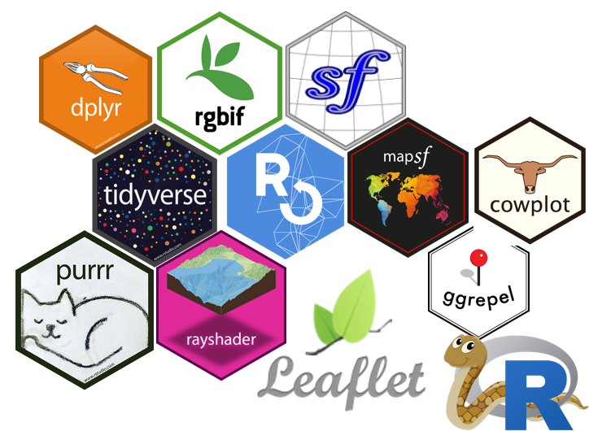

```{r setup, include=FALSE}
#------------------------------------------------------------------------

```

# Modulo 01 

Column {data-width=200}
-----------------------------------------------------------------------

### Presentación

R es un lenguaje y ambiente de computación estadística. Es software libre, de fuentes abiertas y funciona en Linux, Mac y Windows por igual. En esencia R utiliza funciones agrupadas en paquetes con un objetivo común para hacer operaciones diversas con datos. Por ejemplo, el paquete ggplot2 tiene funciones para hacer gráficos, ape para hacer análisis filogenéticos, maps para dibujar mapas, nlme para ajustar y comprar modelos mixtos lineales y no lineales. Y así CRAN (Red Completa del Archivo de R) es una especie de central de abastos donde se regalan las piezas lego de cualquier forma y color que uno necesite.

R es una maravilla por varias razones. No sólo permite hacer todo análisis estadístico imaginable y gráficas increíbles, también es una forma de mostrar, repetir y guardar paso por paso qué análisis y manejo de datos se hizo de principio a fin. R utiliza líneas de código que le dicen qué hacer; el código va acompañado de comentarios hechos por el autor explicando cada paso.  Todo se guarda en un script, un simple archivo de texto que cualquiera puede utilizar para entender o repetir un análisis determinado de principio a fin. Cualquiera, empezando por nosotros mismos tres días, seis meses o diez años después. Si no imaginan la utilidad de esto, busquen en su archivo personal cualquier análisis que involucre más de una pestaña en Excel y díganme, sin sudar frío, ¿cómo llegaron a los resultados?


Column {data-width=200}
-----------------------------------------------------------------------

### Dirigido a 

Ingenieros civiles, ingenieros agrícolas, ingenieros mecánicos de fluidos, ingenieros ambientales y carreras afines, involucrados en el rubro de la Cartografía, hidrología y medio ambiente.

### ¿QUE ES RSTUDIO PARA SIG? ¿POR QUE UTILIZARLO?

R es un software libre acceso que trabaja mediante un lenguaje de programación, utilizando RStudio que es un emulador se puede trabajar los comandos para los Sistemas de Información Geográfica, es  multifuncional gracias a las librerías con las que millones de programadores desarrollan para facilitar procesos.

RStudio proporciona una creciente gama de capacidades a través de sus funciones básicas y gracias a las librerías se puede desarrollar procesos mas complejos. Puede visualizar, gestionar, editar y analizar datos para mapas complejos. Permite manejar formatos de datos ráster y vectoriales a través de librerías.

### 
```{r, out.width="50%"}
# this is the original gif

```

Column {data-width=200}
-----------------------------------------------------------------------

### Acceso y descarga del modulo 01 Aprende R desde Cero para SIG

El proceso de inscripción es el siguiente:
* Efectué el pago de acuerdo a la modalidad correspondiente.
* Envíe el voucher de pago o constancia de la transferencia a: tuspres@gmail.com 
* En un lapso máximo de 02 horas estaremos confirmando su correcta inscripción para darle acceso por un año.

El repositorio de GitHub y el código subyacente de este panel se pueden encontrar en mi Github. [Perfil](https://github.com/GorkyFlorez)

Este dashbaord se desarrolló utilizando [R Studio](https://www.rstudio.com/) y los siguientes paquetes:

* [RMarkdown](https://rmarkdown.rstudio.com/) para análisis reproducibles en documentos de calidad
*  [flexdashbaord](https://rmarkdown.rstudio.com/flexdashboard/) para formatear en RMarkdown
* [DT](https://rstudio.github.io/DT/) para tablas interactivas
* [crosstalk](https://rstudio.github.io/crosstalk/) para widgets html interactivos en RMarkdown


Se presenta otros manuales y ejemplos del uso R para el Sistemas de Informacion Geograficas

* [Mapa de elevacion de la cuenca del Moche](https://imagizer.imageshack.com/img924/2610/8MAxKm.png) 
*  [Mapa de elevacion de la cuenca ](https://imagizer.imageshack.com/img923/5164/KWYuov.png) 
* [Mapa de elevacion de la cuenca del Moche ](https://imagizer.imageshack.com/img923/4498/IdprQB.png) 
* [Mapa de Tipo de Bosque de Madre de Dios](https://imagizer.imageshack.com/img923/7421/tD8EDu.png)
* [Aviso de friaje - (SENAMHI)](https://gorkyflorez.github.io/Aviso_Friaje_MDD/) 
*  [NDVI de Yungay](https://gorkyflorez.github.io/Google_Earth_Engine_RStudio_/) 
* [Calcule la tendencia de las luces nocturnas ](https://gorkyflorez.github.io/luces_nocturnas_GEE/) 
* [Perdida de la cobertura boscosa en la cuenca chonta](https://gorkyflorez.github.io/Analisis_cambio_cobertura_boscosa_microcuenca_chonta/) 

* [INCREMENTO DE TEMPERATURA DIURNA EN LA SELVA](https://gorkyflorez.github.io/Aviso_SENAMHI_155/) 
*  [NDVI de Yungay](https://gorkyflorez.github.io/Google_Earth_Engine_RStudio_/) 
* [Índice de agua de diferencia normalizada Sentinel-2 (NDWI)](https://gorkyflorez.github.io/Google_Earth_Engine_NDWI_Dhaka/) 
* [NDVI en Git de Madre de Dios 2013-2014](https://gorkyflorez.github.io/GEE_NDVI_MDD_Arequi/) 
* [Modelo digital de elevación](https://gorkyflorez.github.io/GEE_DEM/)

Column {data-width=600}
-----------------------------------------------------------------------

### Temario del Modulo 01 Aprende R desde Cero para SIG - Basico {data-height=900}
```{r fll}
knitr::include_graphics("PNG/Modulo 01.jpg")
```

### Enlace {data-height=100}
El Modulo estra comprimido en el siguente enlace de google Drive:
* [Modulo 01 Aprende R desde Cero para SIG - Basico](https://drive.google.com/drive/folders/1zAxSE-QqB6M-ftckkC8Dsfp6aRnYkJIH?usp=sharing) 


